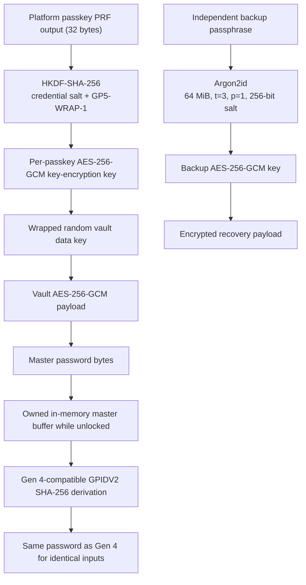
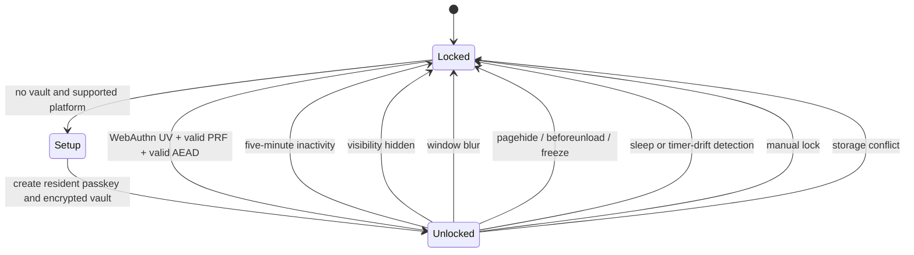

# GoblinPass Gen 5.0 Security Architecture

## Security objective

GoblinPass reproduces the Gen 4 `GPIDV2` deterministic passwords without storing generated passwords. A local encrypted vault preserves the master password. Opening the application requires a user-verifying WebAuthn platform passkey with PRF support.

The design protects confidentiality and integrity against stolen IndexedDB data, casual local access, cross-site attacks, and a lost passkey when recovery was configured. It cannot protect secrets from a compromised browser process, privileged malicious extension, compromised operating system, hostile accessibility software, hardware keylogger, or an attacker observing the screen after unlock.

## Trust boundaries

1. The authenticated HTTPS origin and its reviewed, same-origin scripts.
2. Browser Web Crypto, WebAuthn, IndexedDB, Clipboard, and service-worker implementations.
3. The platform authenticator and its user-verification policy (biometric or device PIN).
4. The operating system, browser profile, extension ecosystem, and physical display.
5. Exported recovery files and the user-chosen backup passphrase.

### Mandatory origin isolation

Gen 5 must be deployed on a dedicated origin such as `vault.example.com`, not merely under `/gen5/` beside unrelated tools. IndexedDB, service-worker authority and WebAuthn RP IDs do not provide path-level isolation. Any same-origin XSS can read the vault record and initiate a PRF ceremony. Dedicated-origin deployment is therefore a release-blocking control, not an optional hardening measure.

No network service receives a master password, PRF output, vault data key, generated password, or backup passphrase.

## Key hierarchy



## WebAuthn unlock sequence

```mermaid
sequenceDiagram
  actor User
  participant App as GoblinPass
  participant Browser
  participant Auth as Platform authenticator
  participant DB as IndexedDB
  User->>App: Unlock
  App->>DB: Read versioned vault and credential wrappers
  App->>App: Generate 256-bit challenge
  App->>Browser: credentials.get(UV required, credential ID, PRF salt)
  Browser->>Auth: Request assertion and PRF evaluation
  Auth->>User: Biometric or secure device PIN verification
  User-->>Auth: Verified
  Auth-->>Browser: Signed assertion + PRF result
  Browser-->>App: PublicKeyCredential
  App->>App: Validate type, origin, crossOrigin, challenge and credential ID
  App->>App: HKDF PRF result into KEK; decrypt wrapped vault key
  App->>App: AES-GCM verify/decrypt payload
  App->>App: Copy master into the locked-lifecycle generator session
  App->>App: Wipe temporary buffers and open UI
```

The assertion is not sent to a server. Local challenge validation prevents implementation confusion and replay within the application, while possession of the fresh PRF result is the effective local decryption capability. XSS would still be able to initiate a ceremony and use its result after user consent, which is why CSP, Trusted Types, dependency pinning, and code review are primary controls.

## Browser lifecycle



Locking drops references to non-extractable `CryptoKey` objects, overwrites application-owned byte arrays, clears password and output fields, hides QR output, and cancels clipboard timers. JavaScript and garbage-collected runtimes cannot guarantee physical-memory erasure.

## Credential lifecycle

- Registration requires a resident platform credential and user verification.
- Every credential has independent 256-bit PRF and HKDF salts and an independently authenticated wrapper around the same random vault data key.
- Adding a credential is an atomic IndexedDB revision update.
- Rotation is add new credential, verify it by locking/unlocking, then remove the old wrapper.
- The last wrapper cannot be removed.
- Removal deletes the local wrapper and calls `signalUnknownCredential` where supported. Browser APIs cannot forcibly delete an OS passkey; the UI must direct the user to OS/passkey-manager settings.
- Legacy schema 1 migration authenticates and decrypts the old record, creates a schema 2 vault and replacement passkey, commits the new vault, and only then deletes the old record.

## Recovery

Recovery exports contain the master password and generator profile salt inside an authenticated AES-256-GCM envelope. The key is Argon2id-derived from an independent passphrase. Exports can be downloaded or displayed as ordered multipart QR codes. Restoration always creates a new platform passkey and never imports a raw passkey secret.

Users must test recovery before removing a credential. Loss of all passkeys and the encrypted backup is intentionally unrecoverable.

## Practical score

- Practical design completeness within the stated browser threat boundary: **10/10**. The design includes the cryptographic, identity, recovery, storage, lifecycle, clipboard, isolation, migration, and operational controls that are reasonably enforceable by a local web application without imposing a second routine secret prompt.
- Current implementation assurance: **8/10** until independent review, cross-browser authenticator testing, and reproducible-release verification are completed. Assurance is deliberately scored separately from design completeness.
- Release readiness is conditional: dedicated-origin deployment with `security-headers.conf` or `_headers`, successful CI, dependency provenance review, and a tested recovery ceremony are mandatory gates.

The 10/10 score does not claim mathematical perfection. JavaScript cannot guarantee physical zeroisation or JIT-level constant time, and no in-browser design can resist a compromised OS, browser process, privileged extension, or coerced user. Those are explicit trust-boundary exclusions, not controls silently omitted from the score.
